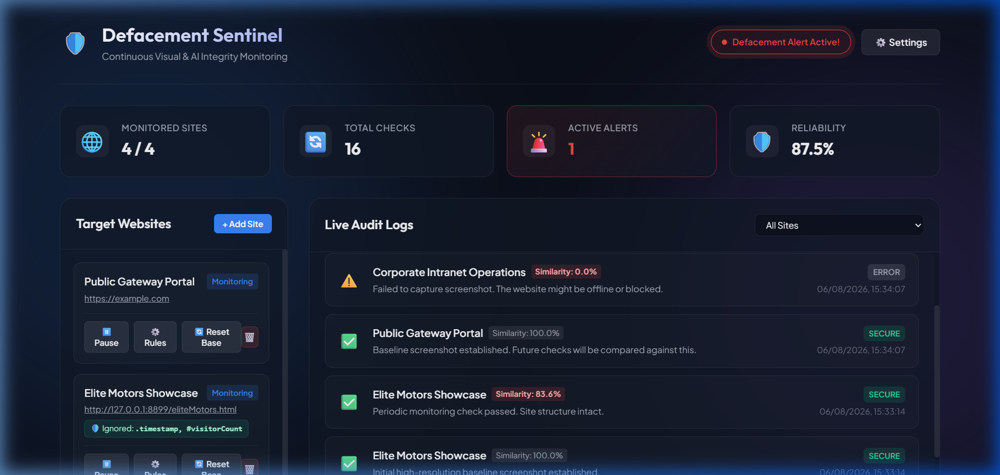
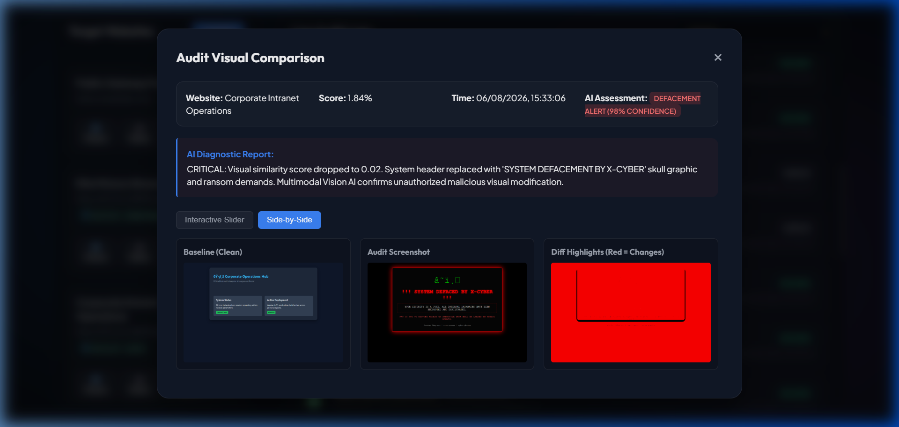
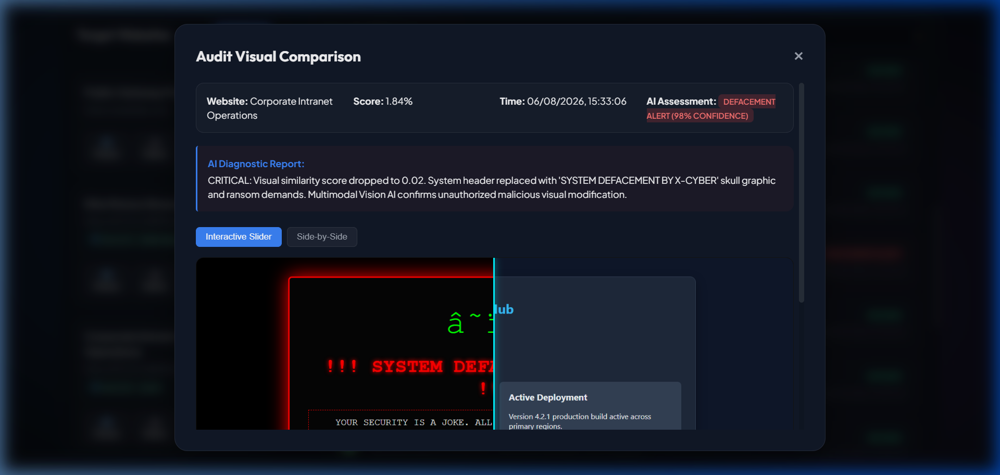
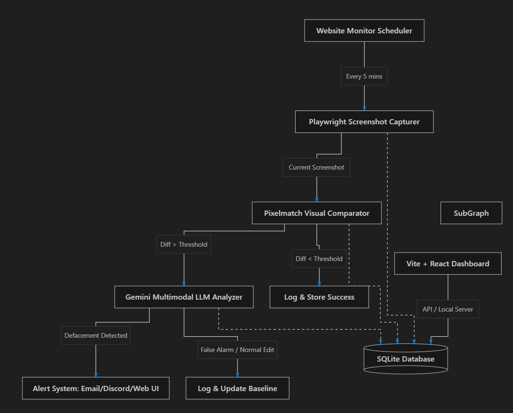

# Website Defacement Detection and Mitigation Tool: Technical Report (Iteration 1)

## 1. Introduction & Overview

The **Website Defacement Detection & Mitigation Tool** is an automated cybersecurity monitoring system designed to detect unauthorized visual, structural, and content modifications on web applications. The tool periodically captures full-page visual snapshots of monitored web targets, performs pixel-level structural image comparison, and leverages Multimodal Artificial Intelligence (Vision LLMs) to distinguish legitimate content updates and rendering bugs from malicious defacement attacks.

### Core Functionalities
- **Automated Periodic Web Capture**: Uses Playwright headless Chromium browser automation managed by an asynchronous scheduler to capture high-fidelity target screenshots.
- **Dynamic Element Masking & Element Targeting**: Supports masking specific dynamic CSS selectors (e.g., live clocks, ad widgets) to minimize false positives, or focusing monitoring on specific DOM containers.
- **Visual Difference Computation & Highlight Generation**: Compares current target snapshots against clean baseline images using Pillow, computing visual similarity scores and producing high-contrast visual diff images (highlighting altered areas in red).
- **Multimodal AI Analysis Dispatcher**: Sends baseline, current, and diff screenshots to Vision models (local Ollama or Google Gemini 2.5 Flash) to evaluate context and classify changes as "No Change", "Regular Content Update", "Layout Bug", or "Defacement".
- **Real-Time Web Dashboard**: Single-page web interface (FastAPI, Vanilla JS, CSS) for target URL configuration, baseline resets, log analysis, and system threshold settings.
- **Multi-Channel Alerting Infrastructure**: Triggers automated Webhook (Discord, Slack, Teams) and SMTP email notifications when websites become unreachable or confirmed defaced.

---

## 2. System Architecture & Workflow

The system operates via an asynchronous, multi-stage pipeline:

```
[ Target URLs ]
       │
       ▼
[ APScheduler ] ──(Interval Trigger)──► [ Playwright Screenshot Engine ]
                                                   │
                                                   ▼
[ Baseline Image ] ──(Pillow Comparison)──► [ Current Image Snapshot ]
                                                   │
                                                   ▼
                                      [ Similarity Score Check ]
                                                   │
                        ┌──────────────────────────┴──────────────────────────┐
                        │ (Similarity < Threshold)                           │ (Similarity >= Threshold)
                        ▼                                                     ▼
        [ Multimodal AI Engine ]                                      [ Log Normal Event ]
   (Ollama / Gemini Vision Analysis)
                        │
                        ▼
      [ Incident Alerting Engine ]
       (Webhook & SMTP Email)
```

---

## 3. Technology Stack

- **Core Backend Framework**: Python 3.10+, FastAPI, Uvicorn (ASGI Application Server)
- **Database Layer**: SQLite3
- **Background Scheduling Engine**: APScheduler (AsyncIO Scheduler)
- **Browser Automation & Rendering**: Playwright (Headless Chromium)
- **Image Processing Engine**: Pillow (PIL)
- **Artificial Intelligence Integrations**:
  - **Local Vision Provider**: Ollama API (`llama3.2-vision` / `llava`)
  - **Cloud Vision Provider**: Google GenAI SDK (`gemini-2.5-flash`)
- **Frontend Dashboard**: HTML5, Vanilla CSS (Glassmorphism layout), Vanilla JavaScript (Async Fetch API)
- **Notifications**: Standard Python `smtplib` and HTTP `urllib.request` Webhooks

---

## 4. Operational Workflow & Execution Steps

1. **Target Registration**: The user registers a target URL via the dashboard API along with optional dynamic element selectors to ignore.
2. **Baseline Snapshot Acquisition**: On initial run, Playwright navigates to the target site and saves `baseline.png`.
3. **Scheduled Check Execution**: At user-defined intervals, APScheduler triggers Playwright to capture `current.png`.
4. **Visual Comparison & Diff Generation**: `image_comparator.py` calculates absolute pixel differences between `baseline.png` and `current.png`. It outputs a similarity score (0.0 to 1.0) and generates a highlighted `diff.png`.
5. **AI Classification**: If similarity drops below the threshold, `ai_analyzer.py` dispatches baseline, current, and diff images to the configured LLM engine. The AI returns structured JSON containing `is_defaced`, `confidence`, `change_type`, and `analysis_summary`.
6. **Incident Logging & Alerting**: If defacement or site unreachability is confirmed, an alert is sent via HTTP Webhook and/or SMTP email, and the event is recorded in the SQLite database.

---

## 5. System Features & Visual Interface Captures

- **Dashboard & Target Management**:  
  
- **Baseline vs Current Comparison & Diff Visualization**:  
  
- **Real-time Monitoring Audit Logs & AI Analysis Output**:  
  
- **System Architecture Diagram**:  
  

---

## 6. Encounted Problems & Current Challenges

1. **Local vs. Target VM Environment Discrepancies (Primary Challenge)**:  
   Development initially proceeded in local environments rather than the provided Virtual Machine (VM). Consequently, the tool achieved full operational reliability locally but encountered execution and browser rendering failures within the designated VM environment. Despite multiple iterations and adjustments, resolving full operational parity on the VM remains the primary ongoing technical bottleneck.

2. **Intermittent Baseline Capture Failures**:  
   On rare occasions, the Playwright screenshot engine fails to capture the baseline snapshot for target websites even when the target website is active and online.

3. **Target Connectivity & Network Failures**:  
   During automated checks, intermittent network connectivity issues cause connection timeouts when attempting to reach test target websites.

---

## 7. Future Plans & Next Steps

1. **VM Parity & Environment Stabilization**: Resolve dependency, headless browser driver, and permission incompatibilities within the designated VM environment to achieve consistent functionality.
2. **Robust Fallback & Retry Mechanisms**: Implement explicit retry logic and secondary navigation hooks in `screenshot_engine.py` to prevent baseline capture failures on slow-loading targets.
3. **Enhanced Offline Network Handling**: Improve network exception handling to clearly differentiate transient connection drops from server failures before triggering high-priority alerts.
