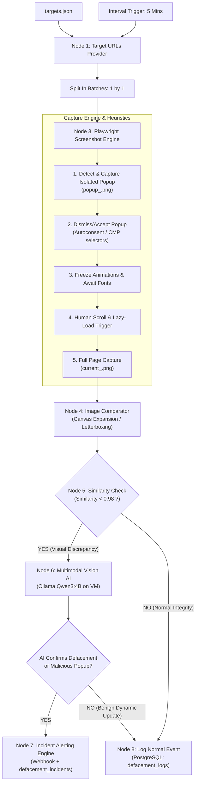

# Website Defacement Detection & Integrity System - n8n Workflow Schematic

This document provides a comprehensive blueprint and connection schematic for the website defacement detection workflow transformed into modular, reusable nodes for **n8n**.

---

## 1. Workflow Architecture & Topology



---

## 2. Node Connection Schematic Table

| Node ID | Node Name | Executable File / Type | Inputs | Outputs | Next Connected Node |
| :--- | :--- | :--- | :--- | :--- | :--- |
| **Trigger** | Interval Trigger | `n8n-nodes-base.scheduleTrigger` | Cron / 5-min interval | Trigger pulse | Node 1: Target URLs Provider |
| **Node 1** | Target URLs Provider | `node_targets.py` | `targets.json` | Array of target JSON objects `[ { id, url, name, ... } ]` | Split Targets in Batches |
| **Batch** | Split Targets in Batches | `n8n-nodes-base.splitInBatches` | Array of targets | Single target item per iteration | Node 3: Playwright Screenshot Engine |
| **Node 3** | Playwright Screenshot Engine | `screenshot_engine.py` | Target URL, ID, ignored selectors | `current_path`, `baseline_path`, `popup_path`, `is_baseline_created` | Node 4: Image Comparator |
| **Node 4** | Image Comparator | `image_comparator.py` | `baseline_path`, `current_path` | `similarity_score`, `changed_pixels`, `diff_path`, `canvas_expanded` | Node 5: Similarity Score Check |
| **Node 5** | Similarity Score Check | `n8n-nodes-base.if` | `similarity_score` | Boolean branch (True: `< 0.98`, False: `>= 0.98`) | **True** ➔ Node 6 (AI Engine)<br>**False** ➔ Node 8 (Log Normal) |
| **Node 6** | Multimodal AI Engine | `ollama_analyzer.py` | Baseline, Current, Diff, Popup paths | `is_defaced`, `confidence`, `change_type`, `popup_defaced`, `analysis_summary` | Node 7: Incident Alerting Engine |
| **Node 7** | Incident Alerting Engine | `node_alert.py` | Defacement analysis + image paths | Incident DB ID, Webhook HTTP Status | Workflow End / Slack / Discord |
| **Node 8** | Log Normal Event | `node_logger.py` | Target ID, URL, similarity score | PostgreSQL Log ID, Status | Workflow End / Next Batch |

---

## 3. How to Import the Workflow into n8n

### Option A: One-Click Import from File (Recommended)
1. Open your n8n web dashboard (e.g., `http://<vm-ip>:5678`).
2. Navigate to **Workflows** in the sidebar.
3. Click the top-right **`+ Add Workflow`** button.
4. Click the three dots menu `...` in the top-right corner of the canvas and select **Import from File**.
5. Select the file:
   ```
   d:\A.Mous_Lim\code_mslm\GIT-HUB\website defacement tool\n8n_workflow.json
   ```
6. The entire pre-wired pipeline will appear on your canvas.
7. Click **Save** and toggle the workflow to **Active**.

### Option B: Node-by-Node Execution Commands
In n8n, each node is an `Execute Command` node configured as follows:

- **Node 1 (Target Provider)**:
  ```bash
  python "d:\A.Mous_Lim\code_mslm\GIT-HUB\website defacement tool\node_targets.py"
  ```
- **Node 3 (Screenshot Engine)**:
  ```bash
  python "d:\A.Mous_Lim\code_mslm\GIT-HUB\website defacement tool\screenshot_engine.py" --url "{{ $json.url }}" --target-id {{ $json.id }} --ignored-selectors "{{ $json.ignored_selectors }}" --target-selectors "{{ $json.target_selectors }}"
  ```
- **Node 4 (Image Comparator)**:
  ```bash
  python "d:\A.Mous_Lim\code_mslm\GIT-HUB\website defacement tool\image_comparator.py" --baseline "{{ $json.baseline_path }}" --current "{{ $json.current_path }}" --diff-output "{{ $json.current_path.replace('current_', 'diff_') }}"
  ```
- **Node 5 (IF Condition)**:
  - Value 1: `{{ $json.similarity_score }}`
  - Operation: `Smaller than`
  - Value 2: `0.98`
- **Node 6 (Multimodal AI Engine)**:
  ```bash
  python "d:\A.Mous_Lim\code_mslm\GIT-HUB\website defacement tool\ollama_analyzer.py" --baseline "{{ $('Node 3: Playwright Screenshot Engine').item.json.baseline_path }}" --current "{{ $('Node 3: Playwright Screenshot Engine').item.json.current_path }}" --diff "{{ $json.diff_path }}" --popup "{{ $('Node 3: Playwright Screenshot Engine').item.json.popup_path }}" --target-id {{ $('Node 3: Playwright Screenshot Engine').item.json.target_id }} --url "{{ $('Node 3: Playwright Screenshot Engine').item.json.url }}"
  ```
- **Node 7 (Incident Alerting)**:
  ```bash
  python "d:\A.Mous_Lim\code_mslm\GIT-HUB\website defacement tool\node_alert.py" --target-id {{ $json.target_id }} --url "{{ $json.url }}" --change-type "{{ $json.change_type }}" --confidence {{ $json.confidence }} --summary "{{ $json.analysis_summary }}" --similarity {{ $('Node 4: Image Comparator (Canvas Expansion)').item.json.similarity_score }} --screenshot "{{ $('Node 3: Playwright Screenshot Engine').item.json.current_path }}" --diff "{{ $('Node 4: Image Comparator (Canvas Expansion)').item.json.diff_path }}" --popup "{{ $('Node 3: Playwright Screenshot Engine').item.json.popup_path }}"
  ```
- **Node 8 (Log Normal Event)**:
  ```bash
  python "d:\A.Mous_Lim\code_mslm\GIT-HUB\website defacement tool\node_logger.py" --target-id {{ $('Node 3: Playwright Screenshot Engine').item.json.target_id }} --url "{{ $('Node 3: Playwright Screenshot Engine').item.json.url }}" --similarity {{ $json.similarity_score }} --screenshot "{{ $('Node 3: Playwright Screenshot Engine').item.json.current_path }}" --popup "{{ $('Node 3: Playwright Screenshot Engine').item.json.popup_path }}"
  ```

---

## 4. Node Engineering Specifications & Improvements

### Node 3: Playwright Screenshot Engine (`screenshot_engine.py`)
1. **Anti-Bot Stealth & Evasion**:
   - Chromium launch flags: `--disable-blink-features=AutomationControlled`, `--no-sandbox`, `--disable-infobars`.
   - `add_init_script`: Masks `navigator.webdriver` to `undefined`, mocks `window.chrome` runtime API, and emulates realistic desktop plugins and languages (`en-US`, `en`).
   - Realistic User-Agent: `Mozilla/5.0 (Windows NT 10.0; Win64; x64) AppleWebKit/537.36 ... Chrome/124.0.0.0 Safari/537.36`.
2. **Infinite Scroll & Lazy-Load Triggering**:
   - Performs smooth incremental scrolling down the page (with natural 350ms pauses) to trigger viewport lazy-loaded ``, `<picture>`, and background assets.
   - Smooth mouse movement emulation to bypass behavioral biometric bot detection.
   - Scrolls cleanly back to `(0, 0)` for snapshot alignment.
3. **Stabilization & False-Positive Mitigation**:
   - Waits for `document.fonts.ready` to eliminate font swap layout shifts (CLS).
   - Injects CSS freezing all animations and transitions (`* { animation: none !important; transition: none !important; }`), ensuring hero banners and rotating carousels do not produce different pixel frames between runs.
   - Graceful `networkidle` fallback: Times out after 15s if background WebSockets/polling keep connections alive, falling back smoothly to DOM completion.
4. **Separate Popup Isolation & Capture**:
   - Detects CMP cookie dialogs, GDPR banners, and overlay modals using selectors inspired by *autoconsent* and *Consent-O-Matic* (OneTrust, Cookiebot, Didomi, TrustArc, Google Funding Choices).
   - **Isolates and screenshots the popup separately** to `screenshots/{target_id}/popup_{timestamp}.png`.
   - Logs the popup in PostgreSQL `defacement_popups` to detect malicious injected modals or fake login popups.
   - Automatically dismisses/accepts the popup so the clean underlying webpage can be screenshotted without occlusion.

### Node 4: Image Comparator (`image_comparator.py`)
- **Canvas Expansion (Letterboxing / Padding)**:
  - Completely eliminates image distortion and squashing caused by `.resize()`.
  - Calculates `max_width = max(w1, w2)` and `max_height = max(h1, h2)`.
  - Pastes both baseline and current snapshots at `(0, 0)` on neutral canvases.
  - Overlapping regions align with 100% pixel fidelity. Newly added or deleted page sections at the bottom compare against a clean background and are accurately highlighted in red.
  - Generates visual difference overlay and calculates `similarity_score` (0.0 to 1.0).

### Node 6: Multimodal Vision AI (`ollama_analyzer.py`)
- Connects directly to the client VM's Ollama instance hosting `Qwen3:4B` (or `qwen2.5-vl` / `llama3.2-vision`).
- Transmits base64-encoded Baseline, Current, Visual Diff, and **Isolated Popup** images.
- Distinguishes between:
  - **Defacement**: Unauthorized text, graffiti, political messaging, hacking manifestos, phishing login modals.
  - **Regular Content Update**: News feeds, timestamp shifts, changing dynamic ads.
  - **Layout Bug**: Broken CSS, temporary missing images (non-malicious).
- Evaluates isolated popup snapshots to detect malicious popup injection.

### Node 7: Incident Alerting Engine (`node_alert.py`)
- Delivers real-time incident notifications to Discord, Slack, or n8n webhooks.
- Formats message with site name, URL, change type, AI confidence percentage, and technical summary.
- Records the incident into PostgreSQL `defacement_incidents` table.

### Node 8: Log Normal Event (`node_logger.py`)
- Records routine verification checks and baseline snapshot establishments into PostgreSQL `defacement_logs` table.

---

## 5. PostgreSQL & Client VM Setup Guide

### Environment Variables (`.env`)
Create a `.env` file in the root folder (or copy from `.env.example`):
```ini
# PostgreSQL Database (Client VM Credentials)
POSTGRES_HOST=127.0.0.1
POSTGRES_PORT=5432
POSTGRES_DB=website_defacement
POSTGRES_USER=postgres
POSTGRES_PASSWORD=your_password_here

# Ollama Multimodal Vision AI (Client VM Endpoint)
OLLAMA_HOST=http://127.0.0.1:11434
OLLAMA_MODEL=qwen3:4b
OLLAMA_TIMEOUT=60

# Webhook Alert Destination
ALERT_WEBHOOK_URL=https://discord.com/api/webhooks/...
```

### PostgreSQL Database Schema
The database handler ([database.py](file:///d:/A.Mous_Lim/code_mslm/GIT-HUB/website%20defacement%20tool/database.py)) automatically initializes all tables:
1. `defacement_logs`:
   - `id`, `target_id`, `url`, `timestamp`, `similarity_score`, `is_defaced`, `confidence`, `change_type`, `analysis_summary`, `screenshot_path`, `diff_path`, `popup_screenshot_path`, `status`, `error_message`
2. `defacement_incidents`:
   - `id`, `target_id`, `url`, `timestamp`, `change_type`, `confidence`, `summary`, `alert_sent`
3. `defacement_popups`:
   - `id`, `target_id`, `url`, `timestamp`, `popup_screenshot_path`, `is_defaced`, `analysis_summary`

---

## 6. Standalone Execution (Alternative to n8n)
If you wish to run the scheduled pipeline as a standalone background service on the VM:
```bash
# Run continuous monitoring with APScheduler interval triggers:
python scheduler.py

# Run a single monitoring pass on all active targets:
python scheduler.py --run-once

# Run a test check on a specific target ID (e.g., target 7):
python scheduler.py --target-id 7
```
